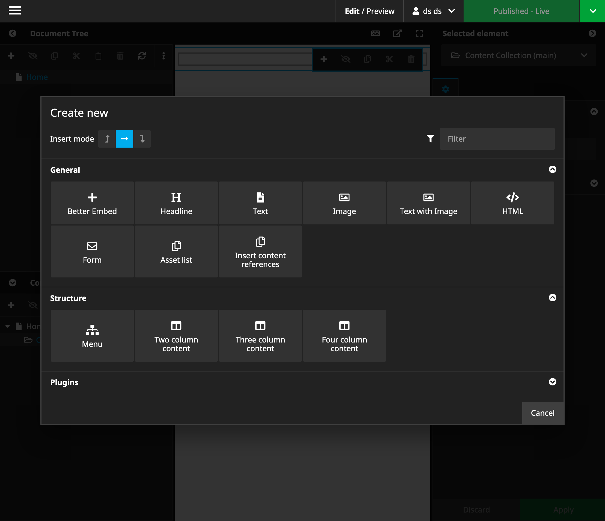
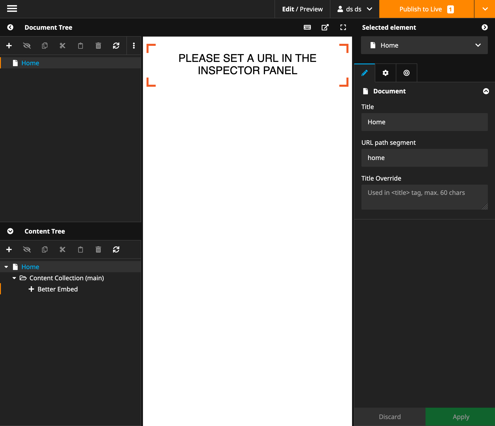
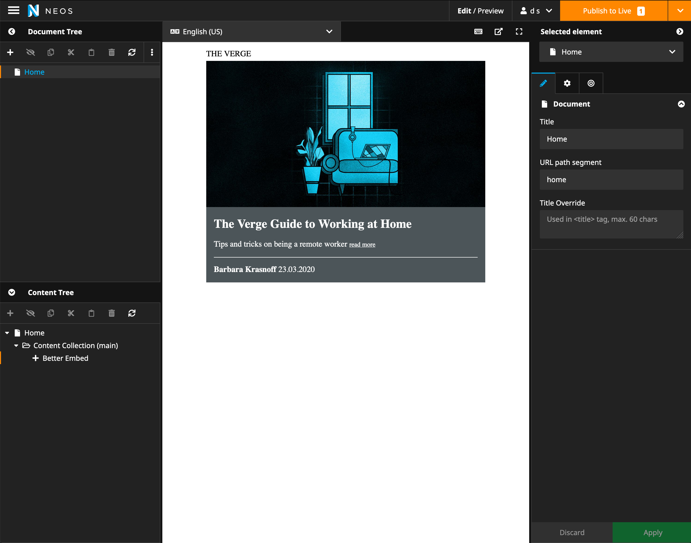
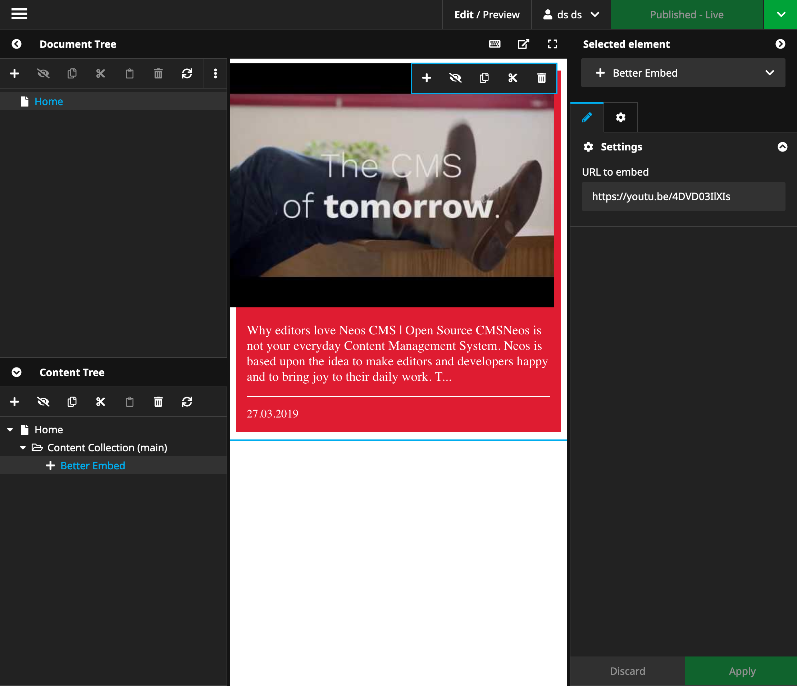

# BetterEmbed integration for Neos CMS

BetterEmbed is a free service to easily integrate content like 
YouTube videos, twitter and facebook posts, blog posts or any other kind of remote content.

## Benefits of BetterEmbed

- easily integrate external content
- improve privacy by keeping out unwanted tracking cookies (GDPR)
- increase page speed by not loading external javascript and css resources

## Installation

Add the dependency to your site package like this

    composer require --no-update betterembed/neos-embed 
    
And then run `composer update` in your projects root folder.

## Dependencies

This package currently only requires Neos >= `4.x` and `guzzlehttp/guzzle`

## Usage

 

 

### Examples
#### Website Example
 
```json
{
  "url": "https://www.neoscon.io/",
  "itemType": "Neos Conference | Tech- and Developer Conference",
  "title": "Neos Conference 2019 in Dresden",
  "body": "Neos Conference is designed for the community and to take everyone further. Because our audience deserves the best content. Everytime.",
  "thumbnailUrl": "https://www.neoscon.io/_Resources/Persistent/c799ecede3620e09013ac72d9f429942764c6a4e/neos_conference_2019-dresden-primary-web.jpg",
  "authorName": "@neoscms",
  "authorUrl": "https://twitter.com/neoscms"
}
```

#### YouTube Example
 
```json
{
  "embedHtml": "<iframe width=\"480\" height=\"270\" src=\"https://www.youtube.com/embed/4DVD03IlXIs?feature=oembed\" frameborder=\"0\" allow=\"accelerometer; autoplay; encrypted-media; gyroscope; picture-in-picture\" allowfullscreen></iframe>",
  "url": "https://www.youtube.com/watch?v=4DVD03IlXIs",
  "itemType": "YouTube",
  "title": "Why editors love Neos CMS | Open Source CMS",
  "body": "Neos is not your everyday Content Management System. Neos is based upon the idea to make editors and developers happy and to bring joy to their daily work. T...",
  "thumbnailUrl": "https://i.ytimg.com/vi/4DVD03IlXIs/hqdefault.jpg",
  "authorName": "Neos CMS",
  "authorUrl": "https://www.youtube.com/channel/UCQndryIh2s9i3htDrpb6tiw",
  "publishedAt": "2019-03-27T00:00:00+00:00"
}
```

## Rendering
The package includes a default rendering component together with an according javascript and css.

### User our own renderer
You can easily register your own rendering component via extending `BetterEmbed.NeosEmbed:ComponentRenderer`:

```
prototype(BetterEmbed.NeosEmbed:ComponentRenderer) < prototype(Neos.Fusion:Case) {
    yourComponent {
        condition = true
        renderer = Your.Component:BetterEmbed {
            @apply.props = ${props}
        }
        @position = 'start'
    }
}
```

## API
The package is based on the BetterEmbed API endpoint.
you can read the API description [here](https://api.betterembed.com/swagger/index.html) and test urls.

## Beta Release
Please note that this is currently a beta release. If you find any issues pls report them or create PR - thx!


